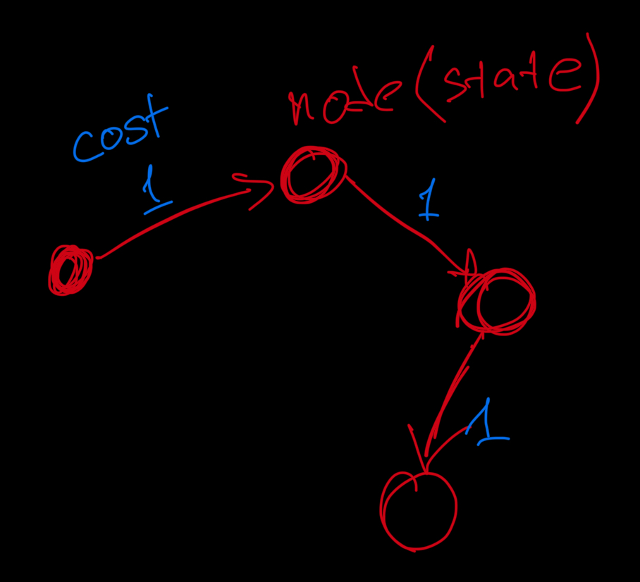
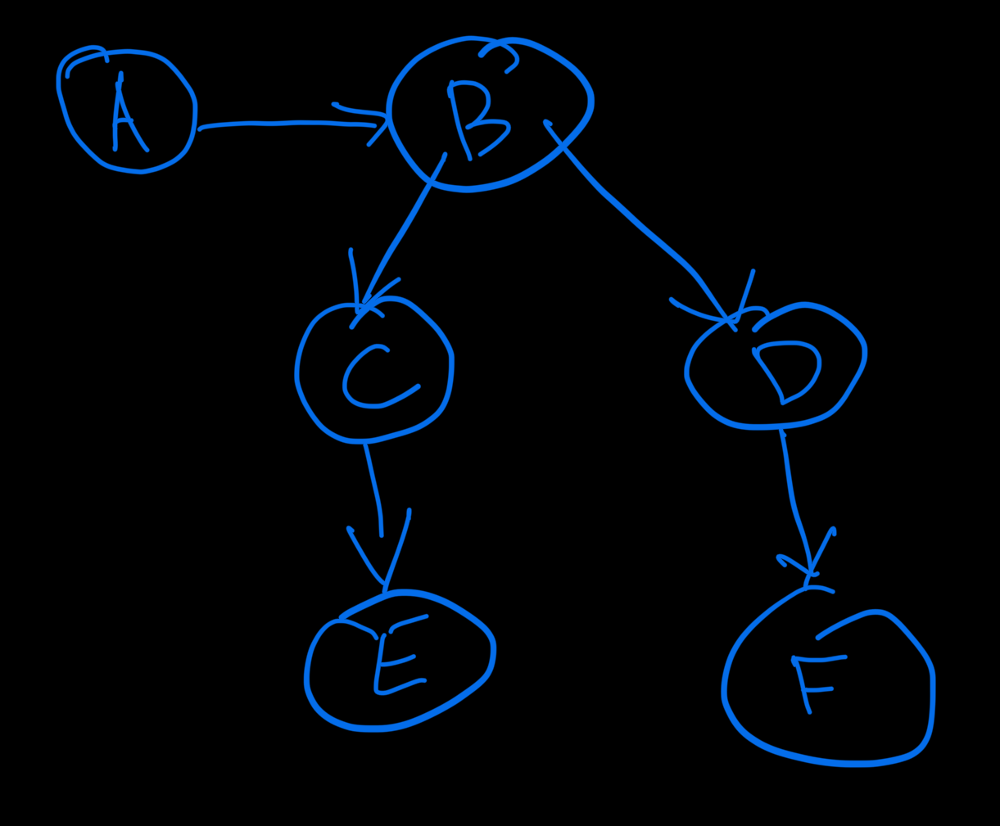

# cs50ai

## startdev.sh
use the command `source ./startdev.sh` to start the development server.

## Search
What to do when a situation is in an environment, and find a solution. 

Can be a puzzle, or a problem. 
Fifteen game, maze, etc. 

Terminology:
- Agent - entity that perceives the environment and acts on it. 
- Environment - the world that the agent operates in. 
- State - the current situation of the agent and environment. 
- Action - choices the agent can take, can be defined as a function of the state. 
- Reward - the feedback signal that the agent receives from the environment. 

Initial state

Actions function Actions(state) -> returns a list of actions, that can be executed in a state(s).

## Transtion model - description of what state we get after taking an action.
Result(state, action) -> returns the new state after taking an action.

State space - all possible states from the initial state by any sequence of actions. 

Reward function - returns a number that represents the goodness of the state. 

Goal test - the way to determine whether a given state is a goal state. 
Path cost - the cost of the path from the initial state to the goal state. 

Search problems;
- Initial state
- Actions
- Transition model
- Goal test
- Path cost function

Solution - a sequence of actions that leads from the initial state to a goal state. 
Optimal solution - the solution with the lowest path cost. 

A node: 
A data structure that keeps track of 
- the state, 
- parent node, 
- action, 
- path cost. 

A frontier - a collection of nodes that are waiting to be expanded. 
Start with a frontier that contains the initial state. 
Repeat:
- If the frontier is empty, then no solution. 
- Remove the node from the frontier. 
- If the node contains a goal state, then return the solution. 
- Else, expand the node, add the resulting nodes to the frontier.

Start from the frontier, and expand the nodes until we find a goal state or the frontier is empty (no solution).

## Find a path from A to E 

Frontier: [A]

### Approach:
Remove the node A from the frontier. 
Check if A is a goal state. 
Expand A, add resulting nodes to the frontier. 

### Revised approach:
Remove a node from the frontier. 
Check if A is a goal state. 
Add A to the explored set. 
Expand A, add resulting nodes to the frontier, if not already in the frontier or explored set. 

howdy

## Search algorithms

### Breadth-first search