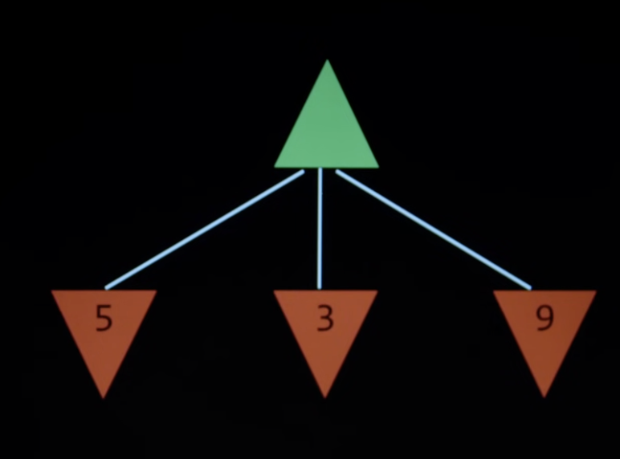

# cs50ai

## startdev.sh
use the command `source ./startdev.sh` to start the development server.

## Search
What to do when a situation is in an environment, and find a solution. 

Can be a puzzle, or a problem. 
Fifteen game, maze, etc. 

Terminology:
- Agent - entity that perceives the environment and acts on it. 
- Environment - the world that the agent operates in. 
- State - the current situation of the agent and environment. 
- Action - choices the agent can take, can be defined as a function of the state. 
- Reward - the feedback signal that the agent receives from the environment. 

Initial state

Actions function Actions(state) -> returns a list of actions, that can be executed in a state(s).

## Transtion model - description of what state we get after taking an action.
Result(state, action) -> returns the new state after taking an action.

State space - all possible states from the initial state by any sequence of actions. 

Reward function - returns a number that represents the goodness of the state. 

Goal test - the way to determine whether a given state is a goal state. 
Path cost - the cost of the path from the initial state to the goal state. 

Search problems;
- Initial state
- Actions
- Transition model
- Goal test
- Path cost function

Solution - a sequence of actions that leads from the initial state to a goal state. 
Optimal solution - the solution with the lowest path cost. 

A node: 
A data structure that keeps track of 
- the state, 
- parent node, 
- action, 
- path cost. 

A frontier - a collection of nodes that are waiting to be expanded. 
Start with a frontier that contains the initial state. 
Repeat:
- If the frontier is empty, then no solution. 
- Remove the node from the frontier. 
- If the node contains a goal state, then return the solution. 
- Else, expand the node, add the resulting nodes to the frontier.

Start from the frontier, and expand the nodes until we find a goal state or the frontier is empty (no solution).

## Find a path from A to E 

Frontier: [A]

### Approach:
Remove the node A from the frontier. 
Check if A is a goal state. 
Expand A, add resulting nodes to the frontier. 

### Revised approach:
Remove a node from the frontier. 
Check if A is a goal state. 
Add A to the explored set. 
Expand A, add resulting nodes to the frontier, if not already in the frontier or explored set. 

## Search algorithms (Order of things in the frontier)

## depth first search (Stack, last in first out) 

Arbitrarily picks a path and goes until hits dead-end , goes back to the last fork, and explores

### Breadth-first search (queue, first in first out)
explores nodes 1 square away, then 2 squares away, then 3

### Uniformed search algorithms
they don't use any information about the problem, except for the definition of the problem itself. 

### Informed search algorithms
they use additional information about the problem to guide the search. 

### Greedy best-first search
Expands the node that is closest to the goal, using a heuristic function h(n) to estimate the distance to the goal.

Manhattan distance is the sum of the absolute differences of the coordinates. (horizontal and vertical distance only)

### A* search
Expands the node that minimizes the estimated total path cost (cost to reach the node g(n) + estimated cost to goal h(n))

Optimal if 
1) h(n) is admissible (never overestimates the actual cost to reach the goal)
2) h(n) is consistent (for every node n and successor n' with step cost c, h(n) ≤ h(n') + c)

## Adversarial search
When the agent and the environment are adversarial, the agent needs to consider the actions of the environment as well as its own actions. 

### Minimax search
Maximizes the agent's score while minimizing the opponent's score. 

- S0: initial state
- PLAYER(s) : returns which player to move in state s
- ACTIONS(s) : returns legal moves in state s
- RESULT(s, a) : returns state after action a taken in state s
- TERMINAL(s) : checks if state s is a terminal state
- UTILITY(s) : final numerical value for terminal state s

Green arrow up tries to maximize the utility function. 
Red arrow down tries to minimize the utility function. 

Given a state s:
- MAX picks action a in Actions(s) that produces
highest value of MIN-VALUE(RESULT(s, a))
- MIN picks action a in Actions(s) that produces
smallest value of MAX-VALUE(RESULT(s, a))

Depth-limited search - limits the depth of the search. 

Evaluation function - evaluates the expected utility of the game from a given state.

